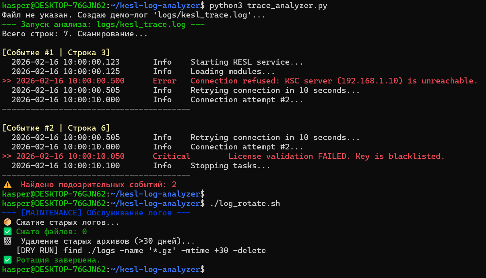

# 🛡️ KESL Log Analyzer


Автоматизированный инструмент для анализа файлов трассировок **Kaspersky Endpoint Security for Linux (KESL)** и Агента администрирования.
Разработан для инженеров L3 Support, чтобы ускорить поиск корневых причин инцидентов (Root Cause Analysis) в логах объемом от 1 ГБ.

---

## 📸 Пример анализа
*(Автоматический поиск ошибок с отображением контекста события)*



---

## 🛠️ Функционал

### 1. `trace_analyzer.py` (Log Parser)
Интеллектуальный парсер текстовых логов.
* **Smart Search:** Использует регулярные выражения (RegEx) для поиска ключевых паттернов: `Error`, `Fail`, `Critical`, `Exception`.
* **Context Awareness:** Выводит не просто строку с ошибкой, а **N строк до и после** события. Это позволяет понять, какое действие привело к сбою (например, обрыв сети *перед* ошибкой лицензии).
* **High Performance:** Оптимизирован для чтения больших файлов построчно, не загружая весь файл в оперативную память.

### 2. `log_rotate.sh` (Maintenance)
Скрипт обслуживания директории логов.
* **Archiving:** Автоматически находит и сжимает (`gzip`) старые логи, чтобы экономить место на сервере.
* **Cleanup:** Удаляет архивы старше 30 дней в соответствии с политикой хранения данных (Retention Policy).
* **Prevention:** Предотвращает переполнение раздела `/var/log`, которое может привести к остановке сервиса KESL.

---

## 🚀 Как использовать

```bash
# 1. Анализ конкретного файла трассировки
sudo python3 trace_analyzer.py /var/log/kaspersky/kesl/kesl_launcher.log

# 2. Запуск без аргументов (создаст демо-лог для теста)
python3 trace_analyzer.py

# 3. Ручной запуск ротации логов
sudo ./log_rotate.sh